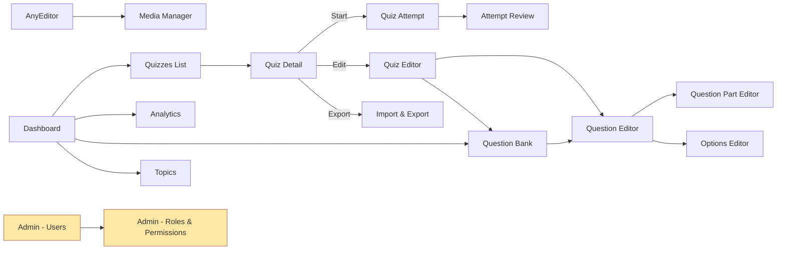

# Site Map (Mermaid)

Below is a high-level navigation sitemap showing primary flows between pages.

```mermaid
flowchart LR
  Dashboard[Dashboard]
  Quizzes[Quizzes List]
  QuizDetail[Quiz Detail]
  QuizEditor[Quiz Editor]
  QuestionEditor[Question Editor]
  QuestionPart[Question Part Editor]
  OptionsEditor[Options Editor]
  Bank[Question Bank]
  Attempt[Quiz Attempt]
  Review[Attempt Review]
  Media[Media Manager]
  Topics[Topics]
  AdminUsers[Admin - Users]
  AdminRoles[Admin - Roles & Permissions]
  Analytics[Analytics]

  Dashboard --> Quizzes
  Dashboard --> Analytics
  Dashboard --> Bank
  Quizzes --> QuizDetail
  QuizDetail -->|Start| Attempt
  QuizDetail -->|Edit| QuizEditor
  QuizEditor --> QuestionEditor
  QuestionEditor --> QuestionPart
  QuestionEditor --> OptionsEditor
  QuizEditor --> Bank
  Bank --> QuestionEditor
  Attempt --> Review
  AnyEditor --> Media
  QuizDetail -->|Export| ImportExport[Import & Export]
  Dashboard --> Topics
  AdminUsers --> AdminRoles

  classDef admin fill:#ffe7a5,stroke:#a65;
  class AdminUsers,AdminRoles admin

  click QuizEditor "./pages/quiz-editor.md" "Open Quiz Editor Doc"
```

Notes
- This sitemap is a minimal overview. Expand with PlantUML for higher fidelity diagrams.
